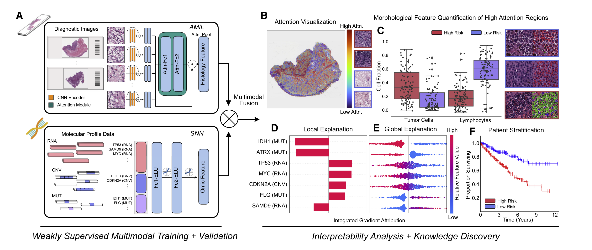
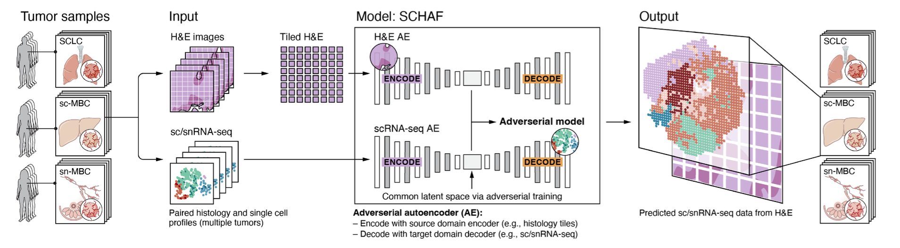

# 单细胞转录组学与病理切片

## 简介

在计算病理学领域，由于病理切片数据的丰富性，通常需要利用卷积神经网络（CNN）将病理切片投射到合适的隐空间（latent space）以向量的形式进行表征，以达到压缩数据大小，获得其低维度的特征（feature），在编码过程使用的神经网络模型也被称作特征提取器（feature extractor）或编码器（encoder）。再完成特征提取后，可以通过后续的网络对目标进行预测。为了整合来自其他模态的信息，通常需要对其他模态的信息与病理特征进行融合，这种融合通常需要首先对其他模态的信息使用类似的方法进行特征提取。近年来，许多工作对于影像、基因突变、病历信息的融合进行了探索^1^。

单细胞组学由于其高分辨率与精准性，在药物敏感性预测领域受到了广泛的关注^2^，但目前尚且欠缺单细胞组学信息如何与病理切片进行多模态深度学习的工作。

>  摘要：在肿瘤学中，患者状态的特征在于一系列的模式，从放射学、组织学、基因组学到电子健康记录。当前的人工智能（AI）模型主要在单一模式领域运作，忽视了更广泛的临床背景，这不可避免地削弱了它们的潜力。不同数据模式的集成为提高诊断和预后模型的稳健性和准确性提供了机会，使人工智能更接近临床实践。人工智能模型还能够发现适合解释患者结果或治疗耐药性差异的模式内部和跨模式的新模式。从此类模型中收集的见解可以指导探索研究，并有助于发现新型生物标志物和治疗靶点。为了支持这些进步，我们在这里概述了用于多模式数据融合和关联发现的人工智能方法和策略。我们概述了人工智能可解释性的方法以及通过多模式数据互连进行人工智能驱动的探索的方向。我们研究临床应用中的挑战并讨论新兴的解决方案。

## 病理组学与测序信息多模态机器学习

先前的研究主要集中于对于病理图像和基因表达信息进行整合^3^，可以较高的提高病理切片的预测能力。

> 摘要：快速新兴的计算病理学领域已经证明了从组织学图像开发客观预后模型的前景。然而，大多数预后模型要么仅基于组织学或基因组学，并且没有解决如何集成这些数据源以开发联合图像组学预后模型。此外，从这些模型中识别出可解释的形态学和分子描述符来控制这种预后也很有意义。**我们使用多模态深度学习来联合检查 14 种癌症类型的病理全切片图像和分子概况数据。我们的弱监督多模态深度学习算法能够融合这些异质模态来预测结果并发现与不良和有利结果相关的预后特征。**我们在交互式开放访问数据库中展示了 14 种癌症类型在疾病和患者水平上患者预后的形态学和分子相关性的所有分析，以便进一步探索、生物标志物发现和特征评估。

## 单细胞特征与病理切片对齐

为了实现数字病理信息与单细胞组学信息的多模态深度学习，需要对单细胞组学信息进行编码。根据近期预印的文献报道^4^，利用对比学习（contractive learning）的方式，可以将病理切片的patch与单细胞组学数据映射到隐空间后，训练其编码器使其在隐空间中的分布接近。之后利用解码器（decoder）解码出patch对应的单细胞类型。

**这种方式提供了一种合理的对单细胞数据进行编码同时与病理数据进行对齐的思路**。可以通过对每个单细胞的测序结果利用SNN（self-normalizing network）进行编码，再通过聚类的方式合并一部分细胞的表达谱，之后通过Transformer或multi-instance learning（MIL）的方式对整合后的病理-单细胞信息进行深度学习进行预测。进一步可以通过Transformer和MIL的特性寻找有意义的生物标志物。

1. Lipkova, J., Chen, R.J., Chen, B., Lu, M.Y., Barbieri, M., Shao, D., Vaidya, A.J., Chen, C., Zhuang, L., and Williamson, D.F. (2022). Artificial intelligence for multimodal data integration in oncology. Cancer Cell *40*, 1095–1110.
2. Wu, Z., Lawrence, P.J., Ma, A., Zhu, J., Xu, D., and Ma, Q. (2020). Single-Cell Techniques and Deep Learning in Predicting Drug Response. Trends in Pharmacological Sciences *41*, 1050–1065. [10.1016/j.tips.2020.10.004](https://doi.org/10.1016/j.tips.2020.10.004).
3. Chen, R.J., Lu, M.Y., Williamson, D.F.K., Chen, T.Y., Lipkova, J., Noor, Z., Shaban, M., Shady, M., Williams, M., Joo, B., et al. (2022). Pan-cancer integrative histology-genomic analysis via multimodal deep learning. Cancer Cell *40*, 865-878.e6. [10.1016/j.ccell.2022.07.004](https://doi.org/10.1016/j.ccell.2022.07.004).
4. Comiter, C., Vaishnav, E.D., Ciampricotti, M., Li, B., Yang, Y., Rodig, S.J., Turner, M., Pfaff, K.L., Jané-Valbuena, J., Slyper, M., et al. (2023). Inference of single cell profiles from histology stains with the Single-Cell omics from Histology Analysis Framework (SCHAF). Preprint at bioRxiv, [10.1101/2023.03.21.533680](https://doi.org/10.1101/2023.03.21.533680)[10.1101/2023.03.21.533680](https://doi.org/10.1101/2023.03.21.533680). 

